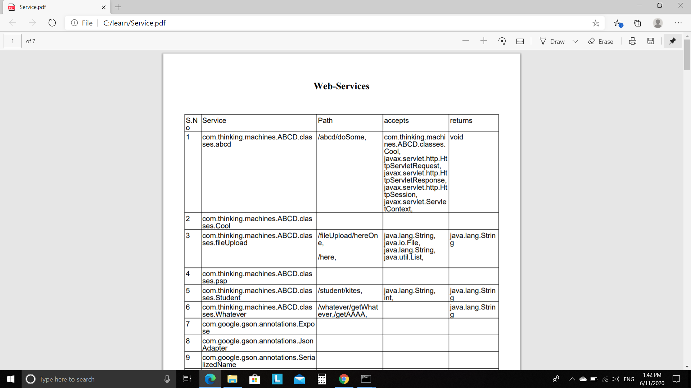
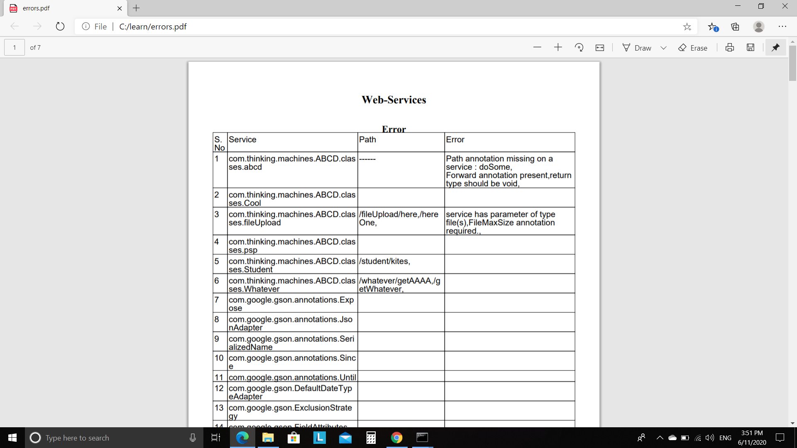
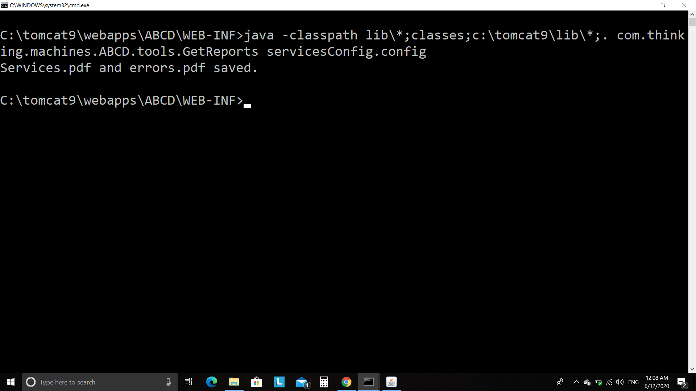

# TMWEB-SERVICE
This framework is designed for server side programming, this framework frees the programmer from writing long and complex java servlet code.
With the help of this framework anyone who can write core java's programmer can do the server side programming,all he/she needs to do is apply simple annotations on services, TMWeb-service will handle everything else for you.

## Prerequisites
- TMWebservices.jar
- gson-2.8.2.jar
- itext-pdfa-5.5.3.jar
- itext-xtra-5.5.3.jar
- itextpdf-5.5.3.jar
- commons-fileupload-1.4-bin.zip
- commons-io-2.7-bin.zip


## Installation
1. Copy/Paste following mapping in <b>web.xml</b> file.
```
<servlet>
<servlet-name>TMService</servlet-name>
<servlet-class>com.thinking.machines.ABCD.services.TMService</servlet-class>
</servlet>
<servlet-mapping>
<servlet-name>TMService</servlet-name>
<url-pattern>/service/*</url-pattern>
</servlet-mapping>
<servlet>
<servlet-name>ABCDInitializer</servlet-name>
<servlet-class>com.thinking.machines.ABCD.services.ABCDInitializer</servlet-class>
<load-on-startup>0</load-on-startup> 
</servlet>
```
2. Put all the jar files mentioned in prerequisites in lib folder.
3. Create a file named as<b>servicesConfig.config</b> in WEB-INF folder and specify the name of jars/packages of your services. Following is the example of json mapping in <b>servicesConfig.config </b>file
```
{
"path" : "c:\\tomcat9\\webapps\\ABCD\\WEB-INF",
"jars" : ['gson-2.8.2.jar','itext-5.3.2.jar'],
"packages" : ['com.thinking.machines.ABCD.classes.*']
}
```
4. Create a folder named as filestore in WEB-INF folder for storing uploaded files.
 
# How To Use ABCD WEB-SERVICE ?

## Annotations
#### 1. Path annotation 
 This annotation is apply on class or methods,it accepts a string.On the basis of value of this annotation url mapping will be done.
 #### Example :
 ```
     example:
     package com.thinking.machines.ABCD.classes;
     import com.thinking.machines.ABCD.annotations.*;
     @Path("/whatever")
     public class Whatever
     {
     @Path("/getWhatever")
     public String getWhatever()
     {
     return "whatever";
     }
     }
 ```
#### 2. RequestData annotation
 This annotation is apply only on parameters,it accepts a string ,the value of this annotation will be mapped with the data of query string and based on that the arguments will be passed to the method.
 #### Example :
 ```
    package com.thinking.machines.ABCD.classes;
    import com.thinking.machines.ABCD.annotations.*; 
    @Path("/student")
    public class Student
    {
    @Path("/kites")
    public String doSomething(@RequestData("nn")String name,@RequestData("aa") int age)
    {
    return "ok got the request"+"\n"+name+" "+age;
    }
    }
```
#### 3. ResponseType annotation 
 This annotation is apply on methods only,it accepts a string but the string can be one of the following
  ```
  "NONE"
  "HTML/TEXT"
  "STRING"
  "JSON"
  ```
 if the value of <b>ResponseType</b> annotation is not from the above then String will be considered by default and the value of this annotation will be treated as mimetype for sending reponse to the client.
#### Example:
```
   package com.thinking.machines.ABCD.classes;
   import com.thinking.machines.ABCD.annotations.*;
   @Path("/whatever")
   public class Whatever
   {
   @ResponseType("STRING")
   @Path("/getWhatever")
   public String getWhatever()
   {
   System.out.println("whatever");
   return "whatever";
   }
   }
```
### 4. Forward annotation 
 This annotation is apply on methods only. After processing the method the request will be forwarded to the url specified in the value of Forward annotation. The return type of the method on which this annotation is applied should be void.
#### Example:
```
    package com.thinking.machines.ABCD.classes;
    public class Cool
    {
    private String name;
    private int price;
    public void setName(String name)
    {
    this.name=name;
    }
    public String getName()
    {
    return this.name;
    }
    public void setPrice(int price)
    {
    this.price=price; 
    } 
    public int getPrice()
    {
    return this.price;
    }
    }
```
```
    package com.thinking.machines.ABCD.classes;
    import com.thinking.machines.ABCD.annotations.*;
    import javax.servlet.http.*;
    import javax.servlet.*;
    @Path("/abcd")
    public class abcd
    {
    @Forward("/aaa.jsp")
    @Path("/doSome")
    public void doSome(Cool cool,HttpServletRequest rq,HttpServletResponse rs,HttpSession hs,ServletContext sc)
    {
    System.out.println(cool.getName()+","+cool.getPrice()+"forwarding request..");
    }
    }
```
### 5. Secured annotation
 This annotation is for class. This annotation provides authentication features to the methods for which the request is arrived. This annotation accepts a String and that string should be the name of a class which must have implemented an interface named as <b>RequestAuthenticator</b>.
#### Example :
 ``` 
   package com.thinking.machines.ABCD.classes;
   import com.thinking.machines.ABCD.annotations.*;
   @Secured("com.thinking.machines.ABCD.classes.psp")
   @Path("/student")
   public class Student
   {
   @Path("/kites") 
   public String doSomething(@RequestData("nn")String name,@RequestData("aa") int age)
   {
    return "ok got the request"+"\n"+name+" "+age;
   }
   }
```
### 6. FileMaxSize annotation
  This annotation is apply on methods. this annotation accepts long type value, the value should specifies the maximum size for the file that is being uploaded from client side. If there is any method which have parameter of type File or File[] needs to apply this annotation.
#### Example :
```
  package com.thinking.machines.ABCD.classes;
  import java.io.*;
  import java.util.*;
  import com.thinking.machines.ABCD.annotations.*;
  @Path("/fileUpload")
  public class fileUpload
  {
  @Path("/here")
  @FileMaxSize(7000)
  public String doSomething(@RequestData("nn")String name,List<File> files)
  {
  int i=0;
  while(i<files.size())
  {
  System.out.println(files.get(i).getName());
  i++;
  }
  return "ok got the request"+"\n"+name;
  }
  @ResponseType("STRING")
  @Path("/hereOne")
  @FileMaxSize(7000)
  public String doSomethingTwo(@RequestData("gg")String name,File file)
  {
  int i=0;
  System.out.println(file.getName());
  return "ok got the request"+"\n"+name;
  }
  }
```
## Interfaces
 1. <b> RequestAuthenticator</b> 
   This is an interface which have two methods in it.
 -  ``` boolean isRequestValid(HttpServletRequest rq,HttpSession session,ServletContext sc);  ```
you have to ones define this method and it should return true if the request is valid and false if the request is invalid . if the request id valid
the method will be processed . else the service will not be processed and another second of interface will be  called .
  - ``` void ifRequestInvalid(HttpServletRequest rq,HttpSession session,ServletContext sc)```
 if the request is invalid this method will be called and and this method will decide what to do with the invalid request.
 #### Example :
  ```
   package com.thinking.machines.ABCD.classes;
   import com.thinking.machines.ABCD.services.*;
   import javax.servlet.http.*;
   import javax.servlet.*;
   public class psp implements RequestAuthenticator
   {
   public boolean isRequestValid(HttpServletRequest rq,HttpSession session,ServletContext sc)
   {
   return false;
   }
   public void ifRequestInvalid(HttpServletRequest rq,HttpSession session,ServletContext sc)
   {
   // do validation
   }
   }
   ```
   
##  Tool for Reporting
 ### With the help of this tool you can have two pdfs 
  -  ### Services.pdf
 This pdf contains the name of your services and what paths you have applied on them, what the service consumes and produces
    

  -   ### Error.pdf
 This pdf contains the name and paths of your services along with that if any error found in your code will be there in pdf  <br>
    

 <b>Example of Errors </b> 
 - Forward annotation applied but return type not void.
 -  Service consumes file(s) but FilemaxSize annotation not applied.
  -  RequestData annotation applied on parameters of a service but have similar values for two different parameter.
   -  Path annotation applied on services have similar values.
  ### How to use this tool ?
  Include the path of lib folder and  your service in classpath
  pass the path of servicesConfig.config file as a command line argument,the  tool will read the path for jars/packages of your services and will load the   
    

### Packages
 #### 1 .  com.thinking.machines.ABCD.services.*
   This package includes the following classes:
  -  ``` ABCDInitializer```
     This class will be instantiated whenever the server will start. This will read the servicesConfig.config file lying in the WEB-INF folder and based on the mapping json mapping done by you all services will be loaded dynamically and necessary data structure will be created.
   -  ```Services```
      This class will be instantiated from ABCDInitializer for each Services. Information related to the services will be stored in it.
  - ```  TMServices``` 
      All the request will be first processed by this servlet and then forwarded to the your services and also response will also be processed by this service and then send to client.
   - ```RequestAuthenticator```
     This interface is also lies in this package.
 ####  2. com.thinking.machines.ABCD.annotations.*
-   All the annotations are in this package.
####  3. com.thinking.machines.ABCD.tools.*;
 Reporting tool for services.pdf/error.pdf is in this package.
   - The name of of main class is``` GetReports```.
 


